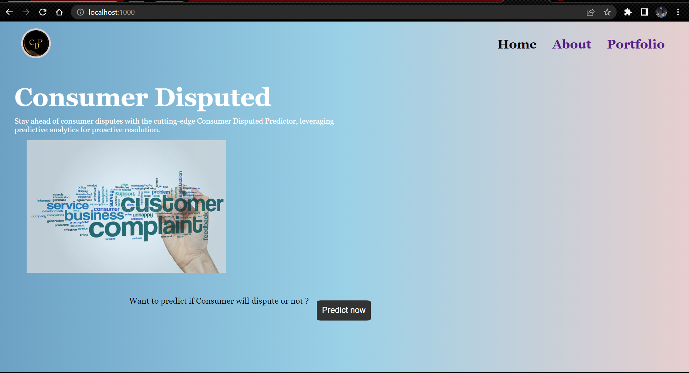
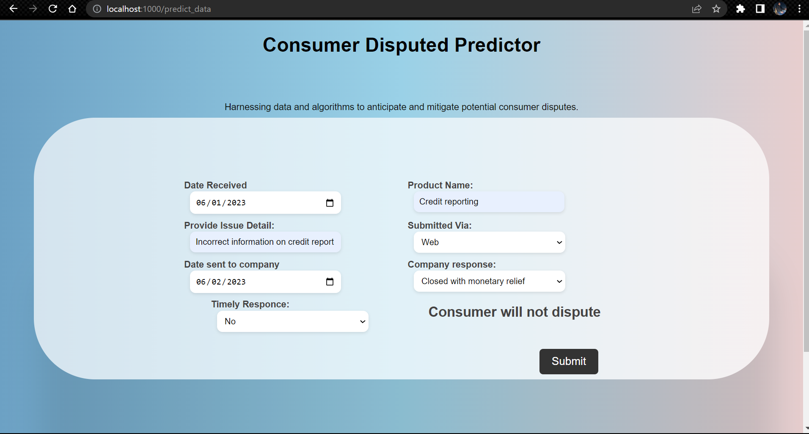

End to end natural language processing project with aws and github actions (CI/CD) project

# Brief explanation of the dataset & features

Unhappy customers may continue to inquire or complain about the resolutions provided, which can harm the business by revealing systemic failures within the Customer Support division and negatively impacting the brand's image. However, resolved disputed complaints can provide valuable data for businesses to derive essential learnings.

We have been provided with a dataset containing the following columns –

● Date received: Date when the complaint was received

● Product: Type of product identified in the complaint, e.g., “Student loan”

● Issue: The issue raised in the complaint, e.g., “Struggling to repay your loan.”

● Submitted via: E.g., “Web” or “Phone.”

● Date sent to the company

● Company response to consumer

● Timely response: Flag specifying if the response was timely

● Consumer disputed: Flag specifying if the consumer disputed the resolution

# what we want as the response:
When customers are dissatisfied with certain aspects of a business, they often contact customer service to raise complaints. While businesses strive to address these complaints, it's not always possible to satisfy every customer completely.

## Prerequisites:
1. Python.
2. Machine learning.
3. Nlp.
4. Github Action.
5. Aws pipelines.

# Installation
1. Create a anaconda environment.
2. Clone the repo.
3. git clone https://github.com/Shivam-Shane/Project.git
4. run application.py
5. open https://localhost:1000 in browser

# Images:

